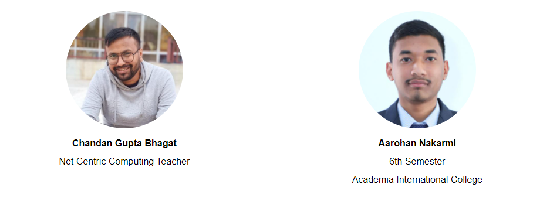

## NCC Lab Work 

- **Lab1:** Create GitHub Repository.

- **Lab2:** [Basic Concept of Object Oriented Programming](https://github.com/workwithAarohan/NCC_LabWork/tree/master/Lab2).

- **Lab3:** [Interface and Delegates](https://github.com/workwithAarohan/NCC_LabWork/tree/master/Lab3)

- **Lab4:** [Basic of C# language](https://github.com/workwithAarohan/NCC_LabWork/tree/master/Lab4)

- **Lab5:** [ASP.NET Core](https://github.com/workwithAarohan/NCC_LabWork/tree/master/Lab5)

- **Lab6:** [CRUD Operation using ASP.NET Core MVC](https://github.com/workwithAarohan/NCC_LabWork/tree/master/Lab6)
